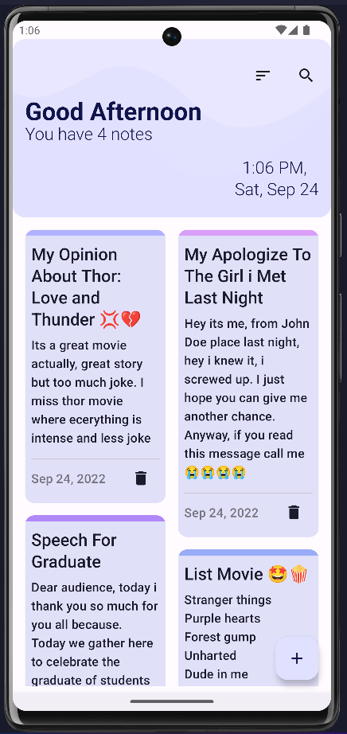
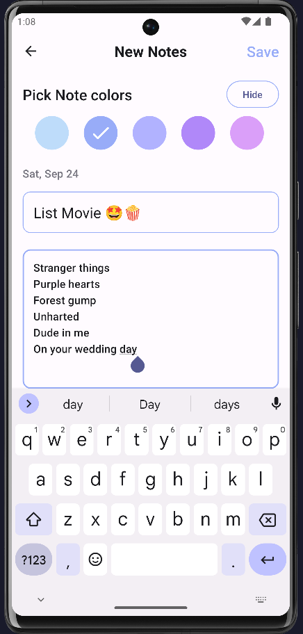
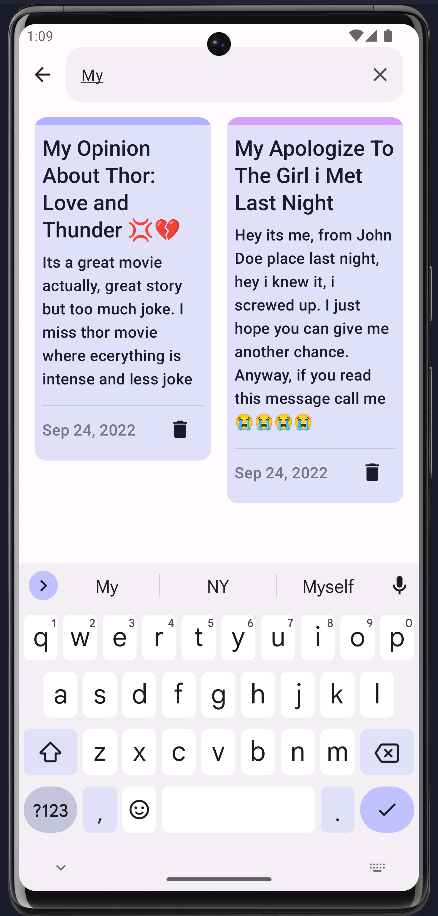

# Notie
Lightweight, performant, simplified and beautiful note app. Design especially for taking note to keep and record all your note in one place.

### Structural design pattern
The app is built with the Model-View-ViewModel (MVVM) is its structural design pattern that separates objects into three distinct groups:
- Models hold application data. They’re usually structs or simple classes.
- Views display visual elements and controls on the screen. They’re typically subclasses of UIView.
- View models transform model information into values that can be displayed on a view. They’re usually classes, so they can be passed around as references.

## Tech Stack.
- [Kotlin](https://developer.android.com/kotlin) - Kotlin is a programming language that can run on JVM. Google has announced Kotlin as one of its officially supported programming languages in Android Studio; and the Android community is migrating at a pace from Java to Kotlin.
- [Material 3](https://m3.material.io/foundations/accessible-design/overview) - Latest Material design for Android.
- Jetpack components:
    - [Jetpack Compose](https://developer.android.com/jetpack/compose) - Jetpack Compose is Android’s modern toolkit for building native UI. It simplifies and accelerates UI development on Android. Quickly bring your app to life with less code, powerful tools, and intuitive Kotlin APIs.
    - [Lifecycle](https://developer.android.com/topic/libraries/architecture/lifecycle) - Lifecycle-aware components perform actions in response to a change in the lifecycle status of another component, such as activities and fragments. These components help you produce better-organized, and often lighter-weight code, that is easier to maintain.
    - [ViewModel](https://developer.android.com/topic/libraries/architecture/viewmodel) -The ViewModel class is designed to store and manage UI-related data in a lifecycle conscious way.
    - [Kotlin-Flow](https://developer.android.com/kotlin/flow) - In coroutines, a flow is a type that can emit multiple values sequentially, as opposed to suspend functions that return only a single value.
- [Kotlin Coroutines](https://developer.android.com/kotlin/coroutines) - A concurrency design pattern that you can use on Android to simplify code that executes asynchronously.
- [Room](https://developer.android.com/jetpack/androidx/releases/room?gclid=CjwKCAjww8mWBhABEiwAl6-2RXqgw6-tYMdlLGJiAhLnEl9PNim-Sz8lx9P6JCaOD9qfQQojs-4DoRoCPkAQAvD_BwE&gclsrc=aw.ds) - Modern SQLite build on top of traditional SQLite, use for local database storage.
- [Dagger Hilt](https://developer.android.com/training/dependency-injection/hilt-android) - A dependency injection library for Android that reduces the boilerplate of doing manual dependency injection in your project.

|             Note Screen              |                Edit Screen                |                Search Screen              |
| :----------------------------------: | :---------------------------------------: | :---------------------------------------: |
|     |           |         |

